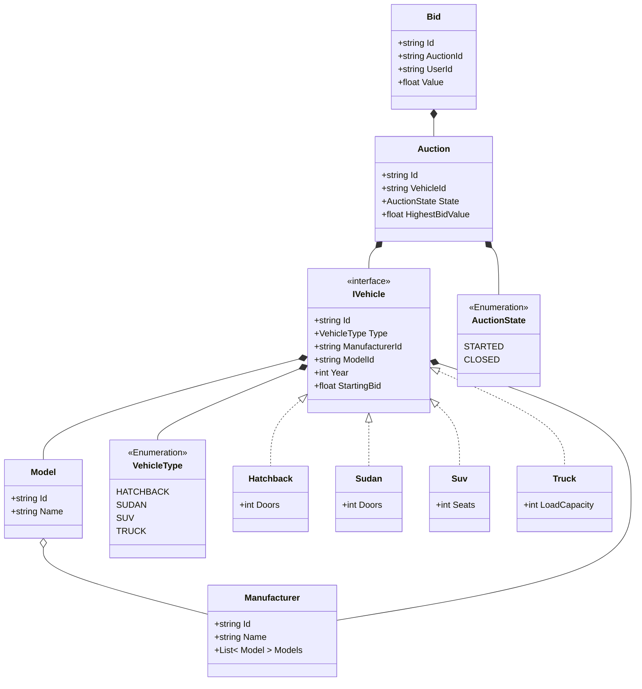
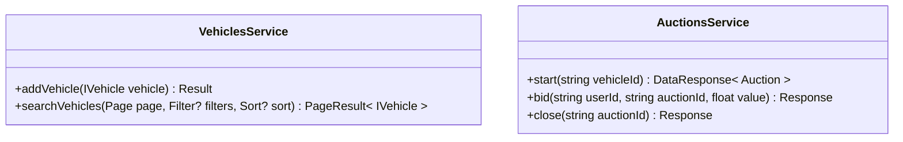
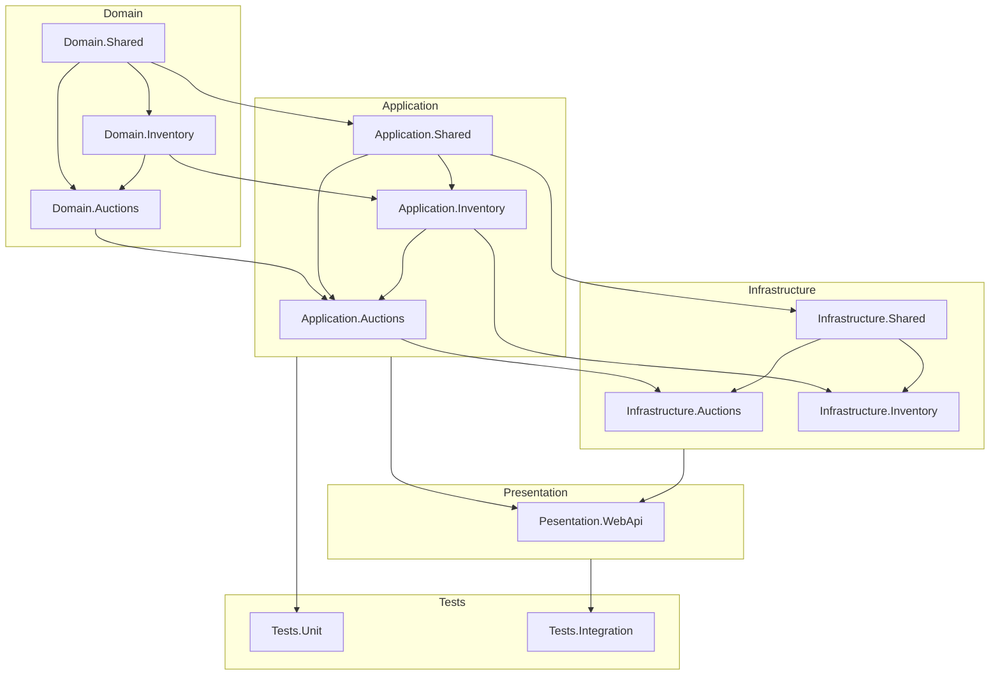

### Content
1. [Decisions and any assumptions](#Decisions-and-assumptions)
2. [Entities Class Diagram](#Entities-Class-Diagram)
3. [Services Diagram](#Services-Diagram)
4. [Solution projects dependencies](#Solution-projects-dependencies)

## Decisions and assumptions 
- I developed a solution following the principles of a Clean Architecture, allowing the benefits:
	- Separation of Concerns by system division into layers, each with a specific responsibility, making the code easier to understand, navigate and maintain.
	- Testability by isolating business logic from external dependencies, it becomes easier to write unit tests.
	- Flexibility as the architecture allows system changes without affecting other parts, making it easier to adapt to new requirements.
	- Reusability as components can be reused across different parts of the application or even in different projects.
- Since WebUI was not a requirement I'm presenting a simple API that calls directly the Application layer, ignoring Authentication, Authorization, Model validations, Anti-Forgery token validations, Telemetry,  etc;
- Since the scope of the project is a simple sytstem that manages auctions, I'm ignoring the user management domain, and so the bids will only receive a hipotetical userId;
- I added the *Manufacturer* and *Model* entities to demonstrate how I would integrate with the *Vehicle*, but then I didn't develop any service to provide CRUD operations on that;
- As the DB management was not a requirement I created a dummy in-memory data system, similar to a DbContext, that is injected as a Singleton (to keep the data during runtime accross requests), this way we just need to run the Api and start calling the endpoints, Also the code doesn't deal with transactions, so I assume every transaction will apply only a single write operation;
- As it was requested to focus on Unit testing, I created unit tests for the conditions defined only on the *Application* level, and also a simple Integration tests stack for all the endpoints (testing all the flow throught the architecture layers);
- Added 2 github actions to run both (Unit and Integration) Tests stack on every commit on *main* branch, assigning the status of the last run to the badges on the top of this doc.

## Entities Class Diagram

## Services Diagram

## Solution projects dependencies

