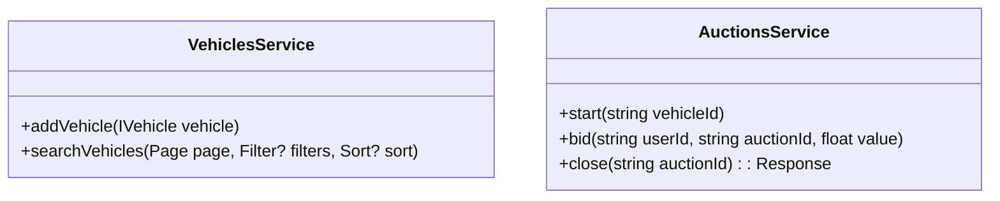

## Decisions and any assumptions 

- Since WebUI was not a requirement I'm presenting a simple API that calls directly the Application layer, ignoring Authentication and Authorization. 
- Since the scope of the project is a simple sytstem that manages auctions, I'm ignoring the user management domain, and so the bids will only receive a hipotetical userId;
- I added the *Manufacturer* and *Model* entities to demonstrate how I would integrate with the *Vehicle*, but then I didn't develop any service to provide CRUD operations on that;
- As the DB management was not a requirement I created a dummy in-memory data system, similar to a DbContext that is injected as a Singleton, this way we just need to run the Api and start calling the endpoints;
- I'm not dealing with transactions, so I assume every transaction will apply only a single write operation. 

## Architecture
```mermaid

```

## Entities Class Diagram

```mermaid
classDiagram
	Model o-- Manufacturer

	IVehicle *-- Manufacturer
	IVehicle *-- Model
	IVehicle *-- VehicleType

	IVehicle <|.. Hatchback
	IVehicle <|.. Sudan
	IVehicle <|.. Suv
	IVehicle <|.. Truck

    Auction *-- IVehicle
    Auction *-- AuctionState

    Bid *-- Auction

    class Manufacturer{
        +string Id
        +string Name
        +List<Model> Models
    }
    class Model{
        +string Id
        +string Name
    }
    class VehicleType{
        <<Enumeration>>
        HATCHBACK
        SUDAN
        SUV
        TRUCK
    }
    class IVehicle{
	    <<interface>>
        +string Id
        +VehicleType Type
        +string ManufacturerId
        +string ModelId
        +int Year
        +float StartingBid
    }
    class Hatchback{
        +int Doors
    }
    class Sudan{
        +int Doors
    }
    class Suv{
        +int Seats
    }
    class Truck{
        +int LoadCapacity
    }
    class AuctionState{
        <<Enumeration>
        STARTED
        CLOSED
    }
    class Auction{
        +string Id
        +string VehicleId
        +AuctionState State
        +float HighestBidValue
    }
    class Bid{
        +string Id
        +string AuctionId
        +string UserId
        +float Value
    }
```

## Services


